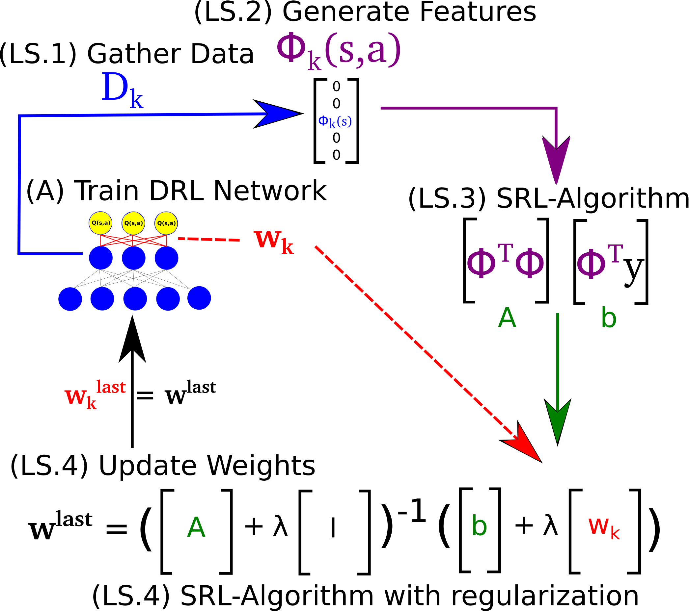

# Shallow_Updates_for_Deep_RL

Official implementation for the paper: "Shallow Updates for Deep Reinforcement Learning"

This code extends the official DQN implementation [[link](https://github.com/kuz/DeepMind-Atari-Deep-Q-Learner)].

## To run:
- Follow the official isntallation isntructions.
- Replace NeuralQLearner.lua with our code (NeuralQLearnerShallow.lua)
- Change initenv.lua, line 14: from "require 'NeuralQLearner'" to "require 'NeuralQLearnerShallow'".

## Features supported:
- Netowrk type: DQN, and DDQN (line 155).
- SRL method: LSTD-Q, FQI, or none (line 156).
- Regularizer coefficient for the SRL methods (line 157).
- SRL updates frequency (line 158).
